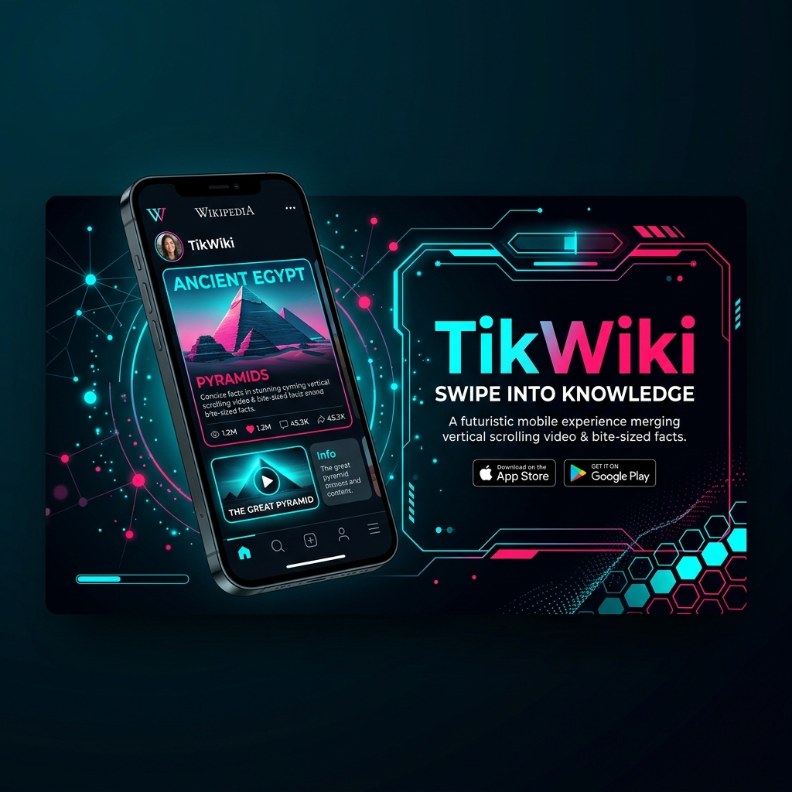
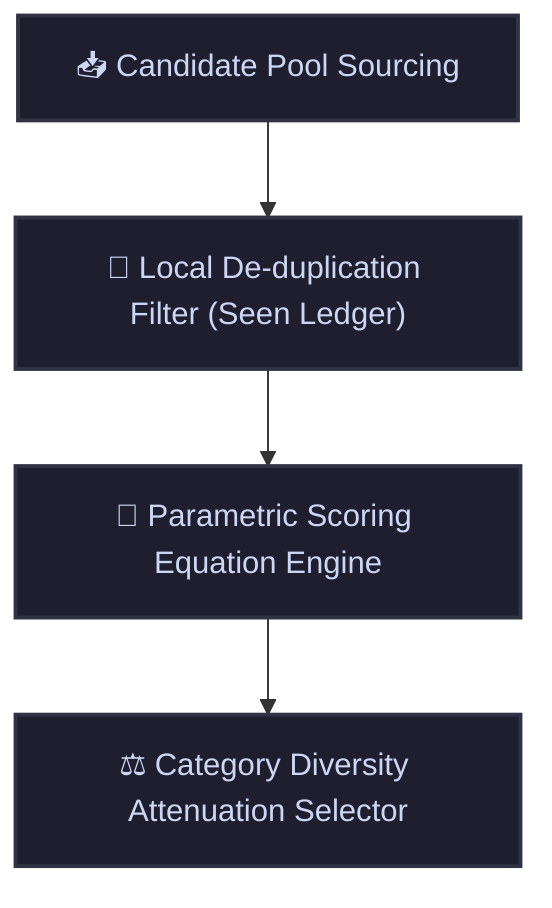

# 📱 TikWiki

[](https://flutter.dev)
[](https://dart.dev)
[](https://firebase.google.com/)
[](https://en.wikipedia.org/api/rest_v1/)

An immersive, short-form micro-learning mobile application built with Flutter. TikWiki translates the hyper-engaging, vertical-scrolling UI/UX design paradigms of TikTok into an educational ecosystem powered by the open Wikipedia knowledge graph.

---

<p align="center">
  
</p>

---

## 🛠️ Project Architecture Overview

TikWiki uses an isolated, modular local monorepo architecture to strictly decouple the data fetching layer, algorithmic scoring mechanism, and presentation state machines.

### Core Directory Blueprint

```plaintext
tikwiki/ (Root Workspace)
├── android/                   # Native Android configuration
├── ios/                       # Native iOS configuration
├── lib/                       # Main Application Shell (UI, State Management, Auth)
│   ├── main.dart              # Entry point & Firebase initialization
│   └── src/
│       ├── auth/              # User Authentication (Firebase Auth)
│       └── feed/              # Presentation layer (Vertical PageView, overlays, sheets)
└── packages/                  # Isolated Monorepo Business & Domain Logic
    ├── wikipedia_api/         # Pure Dart package: Wikipedia API wrapper
    │   ├── lib/src/models/    # DTOs (WikiSummary, WikiFullContent, etc.)
    │   └── lib/src/services/  # HTTP client service layer
    └── tikwiki_algo/          # Pure Dart package: Ranking, Scoring & Filters
        ├── lib/src/models/    # UserProfile, InteractionLogs structures
        └── lib/src/engine/    # FeedRanker implementation
```

---

## 📦 Package Protocols & Contracts

### 1. `wikipedia_api` (Data Source Layer)

This package communicates directly with the official Wikipedia/Wikimedia APIs (REST and Action APIs). It has zero dependencies on Flutter, UI elements, or state management frameworks.

* **Core Models**:
  - `WikiSummary` (Swipe Feed Item Summary)
  - `WikiFullContent` (Serif Reading Page HTML Payload)
  - `WikiSearchResult` (Search Autocomplete Suggestion)
  - `WikiCategoryBundle` (Taxonomy Group Sourcing Candidate Pool)
* **Client Protocol (`WikipediaClient`)**:
  - `fetchRandomBatch({int count = 10})` -> `GET https://en.wikipedia.org/api/rest_v1/page/random/summary`
  - `fetchArticleContent(String title)` -> `GET https://en.wikipedia.org/api/rest_v1/page/html/{title}`
  - `querySearchAutocomplete(String searchTerm)` -> `GET https://en.wikipedia.org/w/rest.php/v1/search/title?q={searchTerm}`
  - `fetchCategoryFeed(String categoryTitle)` -> `GET https://en.wikipedia.org/w/api.php?action=query&generator=search&gsrsearch=morelike:{categoryTitle}&...`

### 2. `tikwiki_algo` (Algorithmic Processing Layer)

A pure domain-logic module that calculates feed scores and manages state filtering. It filters a candidate pool of `WikiSummary` structures and builds a deterministic priority feed based on user telemetry.

#### The 4-Stage Feed Pipeline



#### The Interaction Scoring Formula

To optimize discovery paths, the ranking engine calculates an explicit structural score for every single candidate item:

```math
\text{Score} = (W_{\text{up}} \cdot \text{Upvotes}) + (W_{\text{comm}} \cdot \text{Comments}) + (W_{\text{save}} \cdot \text{Saves}) - (W_{\text{down}} \cdot \text{Downvotes})
```

| Factor / Interaction | Weight | Impact | Description |
| :--- | :--- | :--- | :--- |
| **Upvote** ($W_{\text{up}}$) | `+1` | Positive | Basic approval indicator |
| **Comment Open** ($W_{\text{comm}}$) | `+4` | Positive | Engagement signal (opening comment sections) |
| **Bookmark / Save** ($W_{\text{save}}$) | `+8` | Positive | Strongest positive interest signal (saving to reading lists) |
| **Downvote / Skip** ($W_{\text{down}}$) | `-10` | Negative | Harsh penalty for explicit downvotes or rapid swipes (<3s) |

> [!NOTE]
> Rapid swipes or explicit downvotes trigger immediate category attenuation, reducing the weight of related categories in subsequent feed generations.

---

## 🔥 Backend & Data Synchronization Policy

TikWiki utilizes Firebase Ecosystem services for persistence, authentication, and remote state synchronization.

### 1. Cloud Firestore Schema Protocol

#### User Profile: `/users/{uid}`

```json
{
  "displayName": "String",
  "createdAt": "Timestamp",
  "followed_categories": ["spaceflight", "history", "quantum_physics"]
}
```

#### Interaction History: `/interactions/{uid}`

To prevent excessive write costs during rapid scrolling, user interactions are consolidated and batched into arrays instead of writing standalone documents per interaction.

```json
{
  "seen_article_ids": ["10234", "59302", "11293", "88402"],
  "saved_bookmarks": [
    {
      "article_id": "10234",
      "title": "Quantum Entanglement",
      "saved_at": "Timestamp"
    }
  ]
}
```

### 2. State Buffer & Debounce Synchronization Mechanism

* **Local State Management:** Client-side updates are instantaneous using a local state provider (e.g., Riverpod `Notifier`) to maintain a fluid 120Hz scrolling interface.
* **Write Batching:** Interactions (such as "Article Seen") are stored in an in-memory transactional ledger (`localHistoryBuffer`).
* **Debounce Rules:**
  1. The client syncs with Firestore only when the user remains stationary on an item for **longer than 5 seconds**.
  2. Alternatively, a sync is triggered immediately once the un-synced local buffer reaches **10 items**.

---

## 🚀 Workspace Setup & Commands

To configure, build, and run dependencies uniformly across the monorepo workspace environment, execute the following:

```bash
# Get dependencies across the main application framework
flutter pub get

# Navigate and initialize internal module references natively
cd packages/wikipedia_api && dart pub get
cd ../tikwiki_algo && dart pub get
```

### Monorepo Dependency Declaration (`pubspec.yaml`)

Internal packages are linked within the root workspace config:

```yaml
dependencies:
  flutter:
    sdk: flutter
    
  # Internal Monorepo Packages
  wikipedia_api:
    path: ./packages/wikipedia_api
  tikwiki_algo:
    path: ./packages/tikwiki_algo
```

---

## 🧠 AI Agent Prompting Guidelines

When prompting AI assistants (like Cursor, Copilot, or Gemini) inside this workspace, please reference these structural boundaries:

> [!IMPORTANT]
> 1. **UI Decoupling:** Strictly confine layout and UI changes to `lib/src/feed/`. Do not pollute business logic packages (`packages/`) with UI dependencies or widgets.
> 2. **Model Changes:** If updating data models, modify the core `wikipedia_api` serialization files first, then verify mapping integrations inside `tikwiki_algo`.
> 3. **Testing Isolation:** Ensure state manipulation behavior uses pure, isolated Dart modules that can be verified via `dart test` under internal packages without rendering any Flutter mobile interfaces.